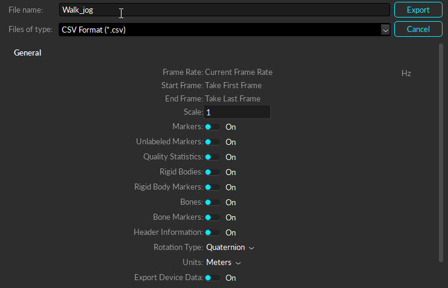

# rosbag_utils

[](https://opensource.org/licenses/BSD-2-Clause)

## Table of Contents
- [rosbag\_utils](#rosbag_utils)
  - [Table of Contents](#table-of-contents)
  - [About](#about)
  - [Installation](#installation)
  - [Usage](#usage)
    - [Setting parameters](#setting-parameters)
      - [YAML file](#yaml-file)
    - [Running conversion scripts](#running-conversion-scripts)
      - [Optitrack Motive](#optitrack-motive)
  - [Future work](#future-work)
  - [License](#license)


## About

This package contains a set of utilities for converting output files from 
various software into ROS bags.

For now, the supported software are:
- [Optitrack Motive](https://optitrack.com/products/motive/)


## Installation

Clone the package into your catkin workspace and build it.

```bash
cd <path/to/catkin/workspace>/src 
git clone https://github.com/selim-cm/rosbag_utils.git
rosdep install -y -r --from-paths src --ignore-src
cd .. && catkin_make # or catkin build rosbag_utils if catkin_tools installed
```

## Usage

### Setting parameters

Parameters can be set either in a YAML file or in the command line.

#### YAML file

Create a YAML file with the following structure (see [config/example_generic.yaml](config/example_generic.yaml) for an example):

```yaml
INPUT_FILE_NAME: <name of the input file>
OUTPUT_FILE_NAME: <name of the output file> 
INPUT_FILE_DIR: <path to the input file directory>
OUTPUT_FILE_DIR: <path to the output file directory>
USE_STAMPED_MESSAGE: <true or false>
INPUT_FILE_PATH: <path to the input file>
OUTPUT_FILE_PATH: <path to the output file>
```

Other parameters specific to the software can be set as well.

You can run the following command to run a conversion script with parameters 
set in a YAML file:

```bash
rosrun rosbag_utils <conversion_script>.py --config <path/to/config.yaml>
```

Or:

```bash
roslauch rosbag_utils <conversion_script>.py --config <path/to/config.yaml>
```

### Running conversion scripts

#### Optitrack Motive

Data from Motive software can be converted to a CSV file using the GUI:



See https://v22.wiki.optitrack.com/index.php?title=Data_Export:_CSV for details.

The additional parameters that can be set for Motive conversion are:

```yaml
TOPIC_PREFIX: <prefix for the topic names>
TOPIC_NAMES: <list of topic names>
```

See [config/example_motive.yaml](config/example_motive.yaml) for an example of
a YAML file for Motive conversion with all the parameters set.

The conversion script [convert\_motive.py](scripts/convert_motive.py) can be
run with the following command:

```bash
rosrun rosbag_utils convert_motive.py --config <path/to/config.yaml>
```

Or by setting the parameters in the command line.


## Future work

- [ ] Update the parameter list and examples
- [ ] Add conversion scripts for other software
- [ ] Test on ROS versions other than Melodic
- [ ] Add requirements details

## License

This package is licensed under the 2-Clause BSD License. See the 
[LICENSE](LICENSE) file for details.

